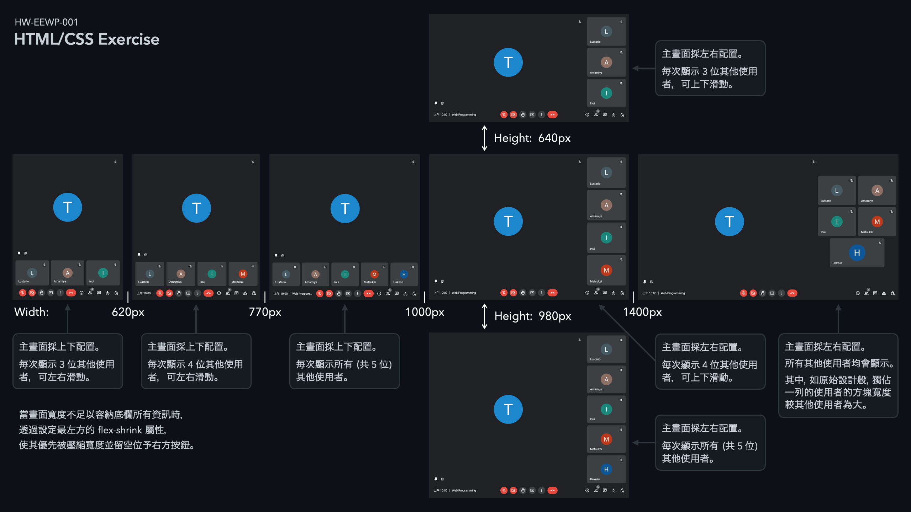

# HW1: HTML/CSS Exercise

同學你好！以下是此份作業的完成情況及簡介，請參考。

## 已完成的基本要求

#### 被釘選的主畫⾯ (左上方)
  - 正中央 - 顯⽰主畫⾯頭貼
  - 右上⾓ - 顯⽰靜⾳狀態
  - 左下⾓ - 顯⽰此畫⾯已被釘選及「你」字
  - 方塊中央 - 以半透明圓角矩形包覆的 3 個功能按鈕
    - 將游標移至使用者所屬方塊上時，群組出現
    - 將游標移至群組上時，其透明度降低

#### 其他會議參與者 (右上方)
  - 有另外 5 名與會者，各自的：
  - 正中央 - 顯⽰主畫⾯頭貼
  - 右上⾓ - 顯⽰靜⾳狀態
  - 左下⾓ - 顯⽰使用者名稱
  - 方塊中央 - 以半透明圓角矩形包覆的 3 個功能按鈕
    - 將游標移至使用者所屬方塊上時，群組出現
    - 將游標移至群組上時，其透明度降低

#### 資訊及功能列 (下方)
  - 非以圖片形式實現
  - 左方 - 目前時間及會議名稱
  - 中央 - 會議功能按鈕
  - 右方 - 會議資訊按鈕

## 已完成的進階要求
- 當游標滑⾄每個「資訊及功能列」的功能按鈕上時，會在該按鈕上⽅顯⽰提⽰
- 當游標滑⾄每個「方塊中央」的功能按鈕上時，會在該按鈕下⽅顯⽰提⽰
- 點擊靜⾳按鈕時，介面可以切換靜⾳/無靜⾳ (提示文字、圖示、右上角靜⾳狀態改變) (使用 checkbox)
- 點擊鏡頭按鈕時，介面可以切換鏡頭開關 (提示文字、圖示改變) (使用 checkbox)
- 初步完成響應式設計 (Responsive Web Design) (詳如下圖所示)

## 其他已完成的項目
- 滑鼠游標移至按鈕上及按下按鈕時，有不同的回饋效果

## 響應式設計 (Responsive Design)

最後更新：2022-09-07 20:46
